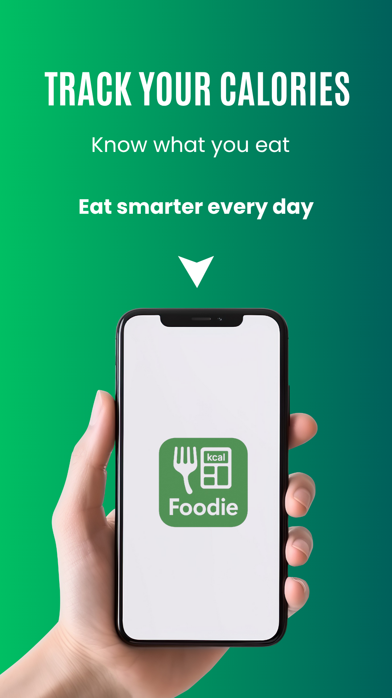
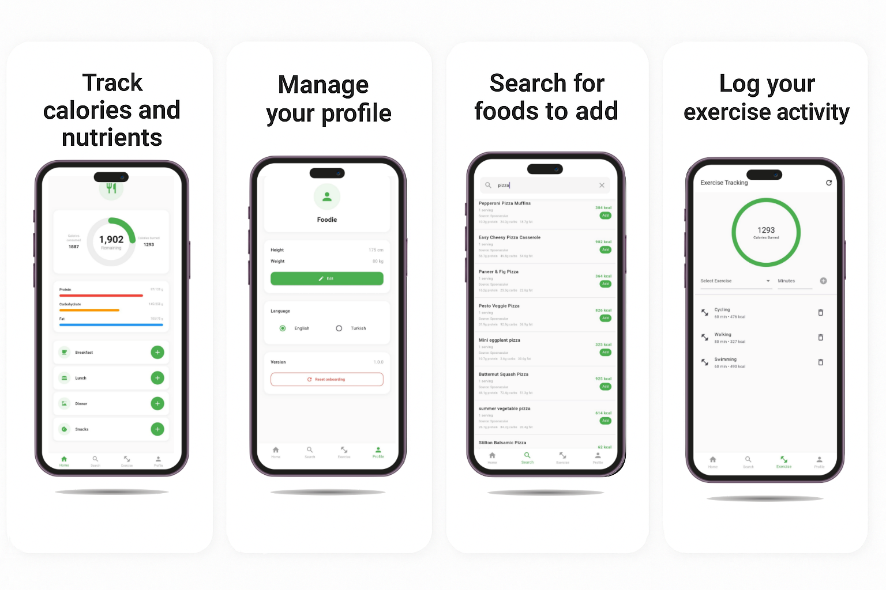
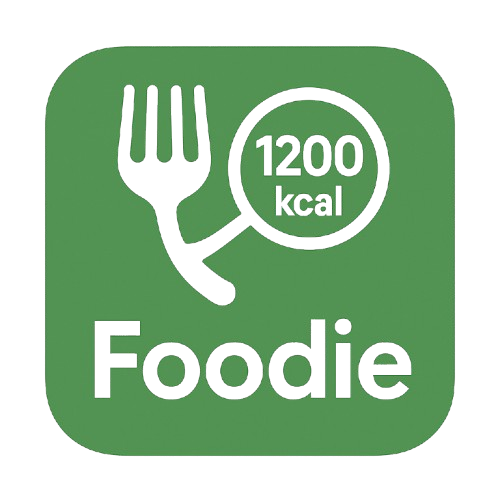

# Foodie - Bilingual Diet App

A Flutter-based diet tracking application with bilingual support (English/Turkish).

## Features
- Bilingual localization (EN/TR)
- Calorie tracking with donut chart (Remaining / Consumed / Burned)
- Macro tracking (Protein, Carbohydrate, Fat)
- Meal management (Breakfast, Lunch, Dinner, Snacks)
- User profile (height/weight, language)
- Onboarding on first launch

## Getting Started

### Prerequisites
- Flutter SDK (stable)
- Dart 3+

### Installation
```bash
flutter pub get
flutter gen-l10n
flutter run
```

## Project Structure
```
./
├─ lib/ …
├─ assets/
│   └─ images/
│       ├─ logo.png
│       ├─ banner.png
│       └─ screens_overview.png
├─ android/ ios/ web/ windows/ linux/ macos/
└─ pubspec.yaml
```

## Screenshots
<p align="center">
  
</p>

<p align="center">
  
</p>

## App Icon
Logo used in the project:
<p align="center">
  
</p>

## License
MIT (see LICENSE)
